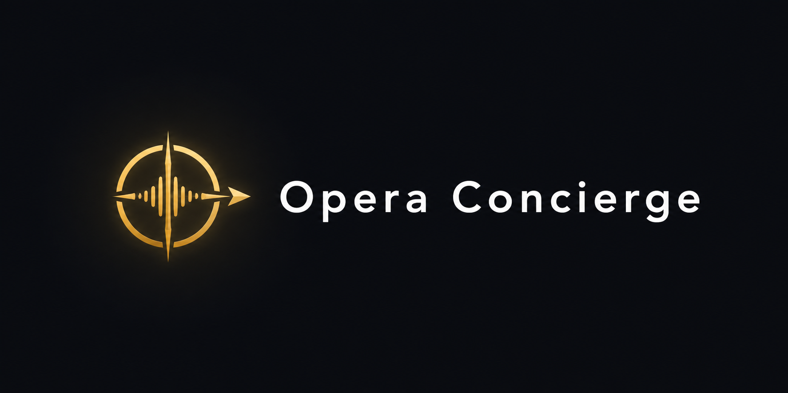

<div align="center">
  

  <h3>Premium AI voice & text agent that operates websites autonomously.</h3>

  <p>
    Visitors of any web can <b>talk</b> or <b>type</b> — Opera Concierge searches, filters, navigates, fills forms, and executes real actions inside the site. Powered by OpenAI Realtime + Vercel AI SDK.
  </p>

  <p>
    <a href="https://vercel.com/new/clone?repository-url=https%3A%2F%2Fgithub.com%2FJoseAI-Automatizaciones%2Fopera-concierge&rootDirectory=apps%2Fdashboard&env=OPENAI_API_KEY,NEXT_PUBLIC_SUPABASE_URL,NEXT_PUBLIC_SUPABASE_ANON_KEY,SUPABASE_SERVICE_ROLE_KEY&envDescription=Required%20keys%20for%20Opera%20Concierge&envLink=https%3A%2F%2Fgithub.com%2FJoseAI-Automatizaciones%2Fopera-concierge%2Fblob%2Fmain%2F.env.example&project-name=opera-concierge&repository-name=opera-concierge">
      
    </a>
  </p>
</div>

---

## What it does

- **Voice + text** — visitors converse naturally (OpenAI `gpt-realtime`).
- **Acts on the page** — clicks, scrolls, fills, filters, navigates.
- **Tool-aware** — can call your APIs (Shopify, custom) when configured.
- **Embeddable** — drop a `<script>` tag and it works. No SDK required.
- **Configurable** — colors, position, shape, prompt, tools — all from the dashboard.

## Project structure

```
opera-concierge/
├── apps/
│   ├── dashboard/   ← Configuration UI + API (Next.js, deployed to Vercel)
│   ├── widget/      ← The embeddable script (Vite + Preact, ~15kb)
│   └── api/         ← Reserved for future split
├── packages/
│   ├── core/        ← Shared types & contracts
│   ├── voice/       ← OpenAI Realtime client wrapper
│   └── tools/       ← Reusable tool definitions
├── CLAUDE.md            ← Read this first if you're working with an AI agent
└── TROUBLESHOOTING.md   ← Known issues + prevention
```

## Local setup

```bash
git clone https://github.com/JoseAI-Automatizaciones/opera-concierge.git
cd opera-concierge
pnpm install
cp .env.example .env.local
# fill in OPENAI_API_KEY and Supabase keys
pnpm dev
```

## Integration

### Recommended: one-line snippet

Once deployed, the dashboard generates a snippet like this. Paste it into any HTML page, just before `</body>`:

```html
<script src="https://your-deploy.vercel.app/widget.js" data-opera-id="YOUR_WIDGET_ID" defer></script>
```

That is the entire integration. Works on Shopify, WordPress, custom sites, Webflow, anywhere HTML is editable.

### Alternative: npm package (for developers / AI coding agents)

For React, Vue, Svelte projects — or when an AI coding agent is integrating Opera Concierge for you — there is a package alternative. See [`apps/widget/CLAUDE.md`](apps/widget/CLAUDE.md) for instructions intended for AI agents to follow autonomously.

## Tech stack

- Turborepo + pnpm
- Next.js 15 (App Router) — dashboard + API
- Vite + Preact — widget
- Vercel AI SDK (`ai`, `@ai-sdk/openai`)
- OpenAI Realtime API (`gpt-realtime`)
- Supabase (Postgres + Auth + Storage)
- Vercel (hosting + serverless)

## Brand

Opera Concierge is a submarca of **Opera AI**. Visual identity: muted mustard gold (`#B08A3E`) on graphite (`#0E1117`), premium and cinematic.

## License

MIT
